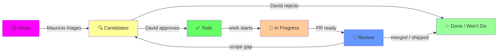

# GitHub Project v2 Board Design: EMHASS AI Agents Dev
## Spec v2.0 | 2026-04-28

> **Changelog v2.0** — trimmed v1.0 after design review:
> - Status: 8 → **6** (Discussion absorbed into Kandidaten via comments; Done/WontDo merged into one terminal column distinguished via linked-issue state)
> - Custom Fields: 6 → **5** (Type and AI-Category merged into single `Category` field with 3 options A/B/Infra; Bug/Feature/Doc filtering moves to native GitHub Issue labels)
> - Milestones: removed; Phase field is the single sequencing mechanism (cross-repo capable)
> - Naming: English in board UI (David & sokorn read it); German notes only here in design doc

---

## 1. Goal & Constraints

**Goal:** Coordinate AI-agent-driven contributions to EMHASS upstream and local development across three personas: OptimalNothing90 (Mauricio, lead curator), sokorn (contributor), davidusb-geek (maintainer/gatekeeper). Board operationalises the Meisterplan phases (0–5) and enforces lightweight CAB-style change control: ideas → candidates → approved → in-progress → review → done.

**Hard Constraints:**

1. **Maintainer self-service** — board operations use only GitHub-native mechanisms (Status moves, comments, reactions, labels). No external tooling, no Claude-skill dependencies, no scripts required before David or sokorn can operate it.
2. **No-auto-push policy** — spec is design-only until user approves Apply Plan. Each apply step is shown as a runnable command, not auto-executed.
3. **Three required sections** map to the workflow: Ideas (=Status `Ideas`), Approved/Todo (=Status `Todo` + `In Progress`), Discussion (=comment threads on cards in Status `Candidates`).
4. **CAB-style triage** — all proposals pass through Candidates before Todo. David's Status move to Todo IS the approval; no separate ceremony.
5. **Scope corridors honoured** — board respects #808 (Layers 1–3, code-injection threat model) and #789 (no coupling-code in core, agnostic glue layer).

---

## 2. Status Workflow Design

### Status Options (6)

| Status | Owner | Purpose |
|--------|-------|---------|
| **📋 Ideas** | anyone | Raw proposal, unreviewed. Title + 1-line description suffice. No commitment to act. |
| **🔍 Candidates** | Mauricio (curator) → David (reviewer) | Triaged: Category/Phase/Priority/Effort/Scope set. Awaits maintainer approval. **Domain discussions happen in card comments here**. |
| **✅ Todo** | David (gatekeeper) | Approved for work. PR can start. Sokorn/Mauricio assigns themselves. |
| **🔄 In Progress** | assignee | Active work. PR open on fork or upstream. Branch deployed locally. |
| **👀 Review** | David (reviewer) | Final maintainer review. Can bounce back to Candidates if scope clarification needed. |
| **✨ Done / Won't Do** | David | Terminal. Linked Issue state distinguishes outcome: `closed-as-completed` = Done, `closed-as-not-planned` = Won't Do. Cards stay for audit trail. |

### State Diagram (Mermaid)



### Mapping to User Requirements

- **Ideas / Brainstorming:** Status `Ideas`. Anyone drops cards here.
- **Approved / Todo:** Status `Todo` + `In Progress`. Card moved here after David's approval.
- **Discussion:** Comment thread on cards in Status `Candidates`. David and sokorn @-mention on cards needing domain input. Lightweight; uses GitHub-native comment notification.

### Why Discussion is not a separate Status

A separate Discussion column duplicates the comment thread. Cards needing maintainer input stay in `Candidates` and David's notification feed surfaces them via comment-mention. Visually one less column to scan; semantically same information. If we find David misses comment-pings, we add `Discussion` later — additive change.

---

## 3. Custom Fields

Beyond GitHub defaults (Assignees, Labels, Milestone, Repository, Linked PRs, Reviewers, Parent issue, Sub-issues progress), add **five** single-select fields:

| Field | Options | Purpose | Filled by |
|-------|---------|---------|-----------|
| **Category** | `A: Code-Lifecycle` / `B: End-User-Ops` / `Infra` | What kind of AI-touchpoint. A = helps coders/maintainers (AGENTS.md, llms.txt, schemas, source bug-fixes, architecture mods). B = helps end-users (skills, cookbook, troubleshoot guides). Infra = backing APIs/contracts that serve both (`/api/last-run`, `/healthz`, `errors.yaml`, `plan_output_schema.md`). Maintains Meisterplan §3.3 distinction. | Mauricio (Triage) |
| **Phase** | `Phase 0` / `Phase 1` / `Phase 1.5` / `Phase 2` / `Phase 3` / `Phase 4` / `Phase 5` | Sequencing per Meisterplan §4. Replaces traditional Milestones (which are repo-scoped; Phase field is cross-repo). | Mauricio (Triage) |
| **Priority** | `P0` / `P1` / `P2` / `P3` | Urgency. P0 = blocker for current phase. | Mauricio (Triage) |
| **Effort** | `XS` / `S` / `M` / `L` / `XL` | Complexity estimate. XS ≈ 1–2h, S ≈ 4–8h, M ≈ 1–3 days, L ≈ 1 week, XL ≈ 2+ weeks. | Mauricio (Triage) |
| **Scope** | `Upstream` / `Local` / `Discussion-Only` | Where work lands: `Upstream` = `davidusb-geek/emhass` PR, `Local` = OptimalNothing90 fork or Node-RED, `Discussion-Only` = not actionable (questions, RFCs). | Mauricio (Triage) |

### Why no separate `Type` field

The `Category` (A/B/Infra) field captures what most matters operationally: who benefits and which Meisterplan track. Bug/Feature/Doc/Architecture distinction can be tagged via **GitHub Issue Labels** (native, free, already a David convention with `bug`, `documentation`, `enhancement` etc.) — no need to duplicate in the project board.

---

## 4. Views (6)

All views are filter-based and auto-populate. No manual curation.

| # | View | Layout | Filter | Group by | Use case |
|---|------|--------|--------|----------|----------|
| 1 | **Ideation Pool** | Board | `Status = Ideas` | `Category` | Brainstorm inbox. Shows raw proposals before triage. |
| 2 | **Candidates Queue** | Board | `Status = Candidates` | `Phase` | Awaits David's review. Comment threads here = discussion. |
| 3 | **Todo Queue** | Board | `Status = Todo` OR `In Progress` | `Phase` | Approved work, sequenced by phase. Sprint-style. |
| 4 | **Active Work** | Table | `Status = In Progress` OR `Review` | `Assignees` | Daily standup view. Who's doing what; PRs linked. |
| 5 | **Roadmap** | Roadmap (or Table fallback) | all open items | `Phase` × `Status` | Phase-funnel visualisation. Quarterly review. |
| 6 | **By Phase** | Table | all items incl. terminal | `Phase` then `Status` | Audit trail. Per-phase completion check. |

**Replaces v1.0 "Discussion Board"** — discussions live as comment threads on cards in Status `Candidates`. View 2 (Candidates Queue) is the operational equivalent.

---

## 5. Sequencing — Phase field, no Milestones

**Decision:** Drop GitHub Milestones entirely. Use the `Phase` custom field instead.

**Why:**
- GitHub Milestones are **per-repo** — a `Phase 1` milestone in `davidusb-geek/emhass` cannot tag local items in `loxonesmarthome` or draft items in the project board itself.
- Project items come from multiple sources: upstream PRs (`davidusb-geek/emhass`), local fork PRs, and project-internal Draft Issues. No single repo where milestones reach all items.
- The `Phase` field on the project board works cross-repo and cross-source. It already gives us the sequencing signal Milestones would.
- David doesn't need to create anything in his repo to make this work.

**Migration path if needed later:** if David explicitly wants release-tracking via Milestones in `davidusb-geek/emhass`, we add Milestones for upstream-only items as a complement to Phase. Additive, not blocking.

### Phase Targets (aspirational)

| Phase | Theme | Target | Notes |
|-------|-------|--------|-------|
| Phase 0 | Local Sanity | 2026-05-03 | mostly shipped (CE-1 deployed, CE-3 deployed, AG-1 deployed) |
| Phase 1 | Upstream Quick-Wins | 2026-05-17 | #812/#813 merged; #814/#816/#817 open |
| Phase 1.5 | Workflow-Demo + AGENTS.md | 2026-05-31 | discussion #808 unblocked, board itself is the demo |
| Phase 2 | Bug-Klärung | 2026-06-14 | U-1, U-2, U-5, U-8 issue-first |
| Phase 3 | Schema/API + Architecture | 2026-07-12 | AC-3, AC-4, AC-1, AC-2, AM-1, AM-2 |
| Phase 4 | EV-Coupling (local) | 2026-08-09 | EV-1..7, AG-3/AG-5 |
| Phase 5 | Long-form | 2026-Q4+ | AG-9, AC-8, CE-7, AM-3/AM-4/AM-6 |

---

## 6. Labels (Repo-Side) — David's call

**Status:** open question for David. Not blocking board launch.

If David wants subscribers to follow `agents-dev`-related work, a single `agents-dev` label on `davidusb-geek/emhass` issues/PRs is enough. Sub-labels (`agents-dev/idea`, `/discussion`, `/approved`) duplicate the project board state — propose only `agents-dev` as the umbrella tag.

```bash
# Reference command for David (do not run from our side)
gh label create agents-dev \
  --repo davidusb-geek/emhass \
  --description "EMHASS AI agents initiative — see Project #2" \
  --color 8B4DE4
```

---

## 7. Item Taxonomy

How Meisterplan items map to board entries. Pattern, not exhaustive list.

### Bugs (U-*)

| Item | Linked Issue | Status flow | Fields |
|------|--------------|-------------|--------|
| **U-1 def_total_hours** | new upstream issue | Ideas → Candidates (David clarifies intent in comments) → Todo → In Progress (PR) → Review → Done | Category=A, Phase=2, Priority=P0, Effort=S, Scope=Upstream |
| **U-3 Solcast 2xx** | (own draft, then file PR-only) | Ideas → Candidates → Todo → In Progress (PR open) → Review → Done | Category=A, Phase=1, Priority=P0, Effort=XS, Scope=Upstream |

### Features (CE-*, AC-*)

| Item | Status | Fields |
|------|--------|--------|
| **AC-3 /api/last-run** | Candidates (security pitch awaiting David) | Category=Infra, Phase=3, Priority=P1, Effort=S, Scope=Upstream |
| **CE-1 Solver-Logging** | Done | Category=B, Phase=0, Priority=P0, Effort=M, Scope=Local |

### AI-Artefacts (AG-*)

| Item | Category | Status |
|------|----------|--------|
| **AG-7 AGENTS.md** | A | Candidates (gated on Workflow-Demo acceptance) |
| **AG-1 emhass-troubleshoot Skill** | B | Done (deployed 2026-04-27) |

### Item-source mapping

| Source | Implementation in board |
|--------|-------------------------|
| Upstream issue exists (e.g., #810) | Add issue to project. Set fields. |
| PR in flight (e.g., #814) | Add PR to project. Linked-PR field auto-populates. |
| Local-only work (no issue) | Create Draft Issue inside project. Scope=Local. |
| Idea, no commitment yet | Create Draft Issue, Status=Ideas. Promote later. |

---

## 8. Approval Mechanics & Project README

### Definition of "Approved"

David moves a card from `Candidates` → `Todo`. That move IS the approval. No separate ceremony, no signing artefact. If David has questions, he leaves a comment on the card; Mauricio responds, and the conversation is the audit trail.

### What Mauricio (curator) does

For each item entering `Candidates`:
1. Sets `Category` / `Phase` / `Priority` / `Effort` / `Scope` per Meisterplan
2. Writes a 1–2 sentence card description: what & why
3. If domain decision is open (e.g., U-2 max_dis convention), adds an explicit comment with the question and `@davidusb-geek`

### What David (gatekeeper) does

- Reviews `Candidates` queue at his own cadence (weekly is plenty)
- For each card: read description + linked issue + scope/category/phase. Either:
  - Move to `Todo` (approved)
  - Leave a comment with the open question (back to Mauricio)
  - Move to `Done / Won't Do` and close linked issue with `not-planned` reason
- For cards in `Review`: same pattern, end-state instead of start-state

### Paste-ready Project README (English)

```markdown
# EMHASS AI Agents Development Board

Coordinates AI-assisted contributions to EMHASS — upstream PRs and local development.
Maintainer scope corridors per Discussion #808 and Issue #789 are honoured.

## Status flow

- **Ideas** — raw proposals. Anyone can add.
- **Candidates** — triaged (Category/Phase/Priority/Effort/Scope set), awaiting maintainer review.
  Domain discussions happen in card comments here.
- **Todo** — approved by maintainer, ready to start.
- **In Progress** — active work. PR open on fork or upstream.
- **Review** — awaiting final maintainer review. Can bounce back to Candidates.
- **Done / Won't Do** — terminal. Linked-issue state distinguishes (closed-completed vs closed-not-planned).

## Roles

- **OptimalNothing90 (Mauricio)** — curator. Triages Ideas → Candidates, sets fields, opens PRs.
- **sokorn** — contributor. Joins discussions, opens PRs, reviews work.
- **davidusb-geek (Maintainer)** — gatekeeper. Approves Candidates → Todo. Reviews PRs.

## Conventions

- Sequencing via the **Phase** field (cross-repo). No Milestones used.
- Domain questions live as **comments on cards in Candidates**. Use `@davidusb-geek` to ping.
- All upstream contributions respect Discussion #808 (Layers 1–3, code-injection threat model)
  and Issue #789 (EMHASS = MILP optimiser; EVCC/HA = hardware/glue, separate tools).

Reference: https://github.com/davidusb-geek/emhass/discussions/808
```

---

## 9. Apply Plan (Checklist)

Each step is a runnable gh CLI / GraphQL command. Placeholders for IDs are noted.

**Project ID:** `PVT_kwHOAfZrVs4BV1jU` (verified 2026-04-28).

### Step 1 — Update Status field options

GitHub Project v2 Status field has built-in defaults (`Todo`, `In Progress`, `Done`). We need to replace with our 6 options. Status field ID: `PVTSSF_lAHOAfZrVs4BV1jUzhROajQ`.

Requires `updateProjectV2Field` mutation. **Note:** API may not allow deleting built-in options directly. Two-step fallback: (a) add new options first, (b) rename/repurpose the three defaults if delete is blocked.

```bash
PROJECT_ID="PVT_kwHOAfZrVs4BV1jU"
STATUS_FIELD_ID="PVTSSF_lAHOAfZrVs4BV1jUzhROajQ"

# Inspect current options
gh api graphql -f query='
{
  node(id: "'$STATUS_FIELD_ID'") {
    ... on ProjectV2SingleSelectField {
      name
      options { id name color }
    }
  }
}'

# Replace options (atomic via updateProjectV2Field)
gh api graphql -f query='mutation {
  updateProjectV2Field(input: {
    fieldId: "'$STATUS_FIELD_ID'"
    singleSelectOptions: [
      {name: "Ideas", color: PURPLE, description: "Raw proposal, unreviewed"}
      {name: "Candidates", color: YELLOW, description: "Triaged; awaiting maintainer review"}
      {name: "Todo", color: GREEN, description: "Approved by maintainer, ready to start"}
      {name: "In Progress", color: ORANGE, description: "Active work, PR open"}
      {name: "Review", color: BLUE, description: "Awaiting final maintainer review"}
      {name: "Done / Wont Do", color: GRAY, description: "Terminal — linked-issue state distinguishes"}
    ]
  }) {
    projectV2Field { ... on ProjectV2SingleSelectField { id options { id name } } }
  }
}'
```

**Web-UI fallback** if the API rejects the mutation:
1. Open https://github.com/users/davidusb-geek/projects/2/settings/fields
2. Edit Status field → delete `Todo`/`In Progress`/`Done`, add the six above

### Step 2 — Add 5 custom fields

```bash
# Category
gh api graphql -f query='mutation {
  createProjectV2Field(input: {
    projectId: "'$PROJECT_ID'"
    dataType: SINGLE_SELECT
    name: "Category"
    singleSelectOptions: [
      {name: "A: Code-Lifecycle", color: BLUE, description: "Helps coding agents / contributors / maintainer"}
      {name: "B: End-User-Ops", color: GREEN, description: "Helps end-users (skills, cookbook, troubleshoot)"}
      {name: "Infra", color: PURPLE, description: "Backing APIs / contracts for both"}
    ]
  }) { projectV2Field { ... on ProjectV2SingleSelectField { id name } } }
}'

# Phase
gh api graphql -f query='mutation {
  createProjectV2Field(input: {
    projectId: "'$PROJECT_ID'"
    dataType: SINGLE_SELECT
    name: "Phase"
    singleSelectOptions: [
      {name: "Phase 0", color: GRAY}
      {name: "Phase 1", color: GREEN}
      {name: "Phase 1.5", color: YELLOW}
      {name: "Phase 2", color: ORANGE}
      {name: "Phase 3", color: BLUE}
      {name: "Phase 4", color: PURPLE}
      {name: "Phase 5", color: PINK}
    ]
  }) { projectV2Field { ... on ProjectV2SingleSelectField { id name } } }
}'

# Priority
gh api graphql -f query='mutation {
  createProjectV2Field(input: {
    projectId: "'$PROJECT_ID'"
    dataType: SINGLE_SELECT
    name: "Priority"
    singleSelectOptions: [
      {name: "P0", color: RED, description: "Blocker for current phase"}
      {name: "P1", color: ORANGE}
      {name: "P2", color: YELLOW}
      {name: "P3", color: GRAY}
    ]
  }) { projectV2Field { ... on ProjectV2SingleSelectField { id name } } }
}'

# Effort
gh api graphql -f query='mutation {
  createProjectV2Field(input: {
    projectId: "'$PROJECT_ID'"
    dataType: SINGLE_SELECT
    name: "Effort"
    singleSelectOptions: [
      {name: "XS", color: GRAY, description: "1-2h"}
      {name: "S", color: GREEN, description: "4-8h"}
      {name: "M", color: YELLOW, description: "1-3 days"}
      {name: "L", color: ORANGE, description: "1 week"}
      {name: "XL", color: RED, description: "2+ weeks"}
    ]
  }) { projectV2Field { ... on ProjectV2SingleSelectField { id name } } }
}'

# Scope
gh api graphql -f query='mutation {
  createProjectV2Field(input: {
    projectId: "'$PROJECT_ID'"
    dataType: SINGLE_SELECT
    name: "Scope"
    singleSelectOptions: [
      {name: "Upstream", color: GREEN, description: "davidusb-geek/emhass PR target"}
      {name: "Local", color: BLUE, description: "Fork or Node-RED, not landing upstream"}
      {name: "Discussion-Only", color: GRAY, description: "RFC/question, not actionable yet"}
    ]
  }) { projectV2Field { ... on ProjectV2SingleSelectField { id name } } }
}'
```

### Step 3 — Set Project README + visibility

```bash
gh api graphql -f query='mutation {
  updateProjectV2(input: {
    projectId: "'$PROJECT_ID'"
    readme: "<paste-from-Section-8>"
    shortDescription: "AI-assisted EMHASS development — upstream PRs and local work"
  }) { projectV2 { id readme } }
}'
```

### Step 4 — Create Views

`createProjectV2View` mutation. Filter syntax uses GitHub project query language (e.g., `status:"Ideas"`).

```bash
# View 1 — Ideation Pool
gh api graphql -f query='mutation {
  createProjectV2View(input: {
    projectId: "'$PROJECT_ID'"
    name: "Ideation Pool"
    layout: BOARD_LAYOUT
  }) { projectV2View { id } }
}'
# → set filter and group-by via updateProjectV2View afterwards
```

**Note:** `createProjectV2View` mutation is undocumented in GitHub's public GraphQL schema as of 2026. Web-UI is the practical path:

1. Open https://github.com/users/davidusb-geek/projects/2
2. New view (`+`) → set name, layout (Board / Table), filter, group-by per Section 4 table
3. Save

This is a one-time 5-minute manual task.

### Step 5 — Verify

```bash
gh api graphql -f query='
{
  node(id: "'$PROJECT_ID'") {
    ... on ProjectV2 {
      title
      shortDescription
      readme
      fields(first: 20) {
        nodes {
          ... on ProjectV2SingleSelectField {
            name
            options { name }
          }
        }
      }
      views(first: 10) { nodes { name layout } }
    }
  }
}'
```

Expected: 1 Status (6 options) + 5 custom single-select fields + 6 views + non-null readme.

### Steps NOT performed by us

- **Labels on `davidusb-geek/emhass`** — David's repo, his call. Reference command in Section 6.
- **Bulk item-import from Meisterplan** — handled in Phase 2 of this rollout (Superpowers `writing-plans`).
- **Inviting/onboarding** — done already (David invited Mauricio + sokorn 2026-04-27).

---

## 10. Open Questions for David & sokorn

1. **Won't-Do separation:** keep terminal as single `Done / Won't Do` column or split into two? Single is simpler; split is more honest about rejected items. Default: single + linked-issue state.
2. **Iterations:** Project v2 supports Iterations (weekly sprints). Worth adding for sprint cadence, or does Phase suffice? Default: skip; reconsider if velocity tracking becomes a need.
3. **Burndown / metrics:** any appetite for cards-completed-per-week dashboards? Default: skip (no current pain point).
4. **`agents-dev` label on `davidusb-geek/emhass`:** David's call. Useful for non-board followers; optional.
5. **sokorn's preferred working pattern:** does he want to be auto-assigned candidates, or self-pull from Todo? Confirm in onboarding comment.

---

## 11. Apply Sequence Overview

```
1. Update Status field options (API or Web UI)            [~2 min]
2. Add 5 custom fields via GraphQL                        [~1 min]
3. Set Project README via GraphQL                         [~30 sec]
4. Create 6 Views via Web UI                              [~5 min]
5. Verify via GraphQL                                     [~30 sec]
                                                  total   ~10 min
```

After verify: Phase 2 starts (Superpowers `brainstorming` + `writing-plans` for item-migration from Meisterplan into the board).

---

## Summary

CAB-aligned GitHub Project v2 board with **6 statuses**, **5 custom fields**, **6 views**, no Milestones, Phase as the sole sequencing field. Discussion lives in card comments under Status `Candidates`, not as a separate column. Naming kept English so David & sokorn read the board natively. All board operations are GitHub-native — David can move any card without Claude in the loop. Apply Plan is ~10 minutes of API + Web-UI work, gated on user approval.
